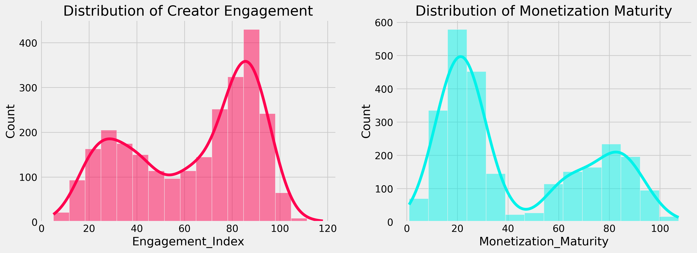
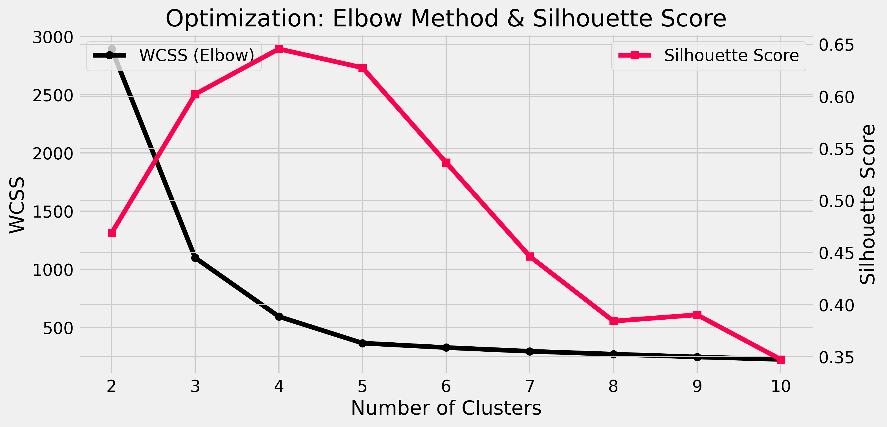
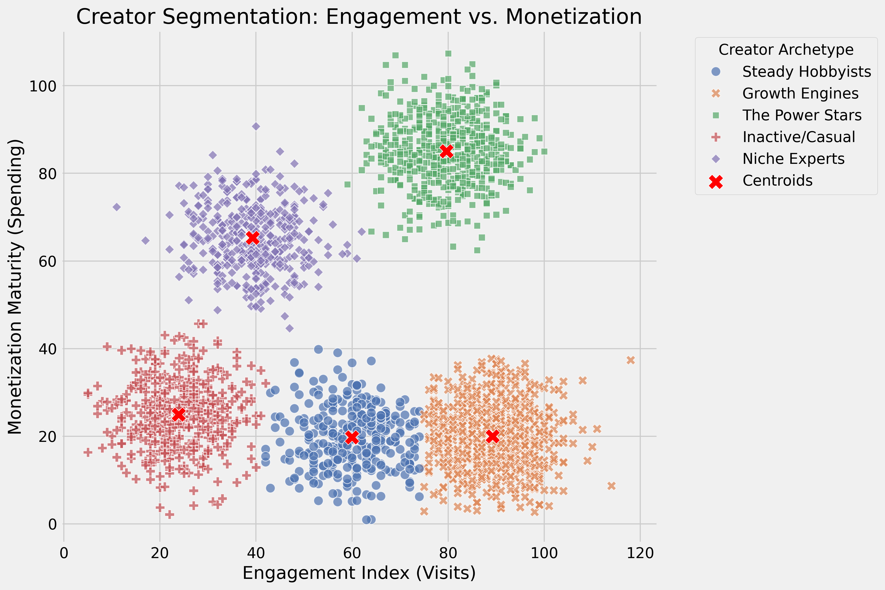

# Creator Lifecycle & Monetization Archetypes: A K-Means Clustering Approach

## 📌 Abstract
Understanding creator behavior is critical for dynamic content delivery, targeted monetization, and platform health. This project applies unsupervised machine learning techniques to segment 2,600 social media creators based on their engagement metrics and monetization maturity. 

Utilizing **K-Means Clustering**, the analysis identifies distinct creator personas, providing actionable insights for product development, ad-revenue share optimization, and creator retention strategies suited for platforms like TikTok.

---

## 📂 Data & Preprocessing
This project utilizes the publicly available [Dataset for K-Means Clustering (Social Media Users)](https://www.kaggle.com/datasets/mitgandhi10/dataset-for-kmeans-clustering) from Kaggle. 

To align with a ByteDance/short-video platform business case, the original dataset features were re-mapped to platform-specific terminology:
* **Original `Instagram visit score` $\rightarrow$ Engagement Index:** Measures the frequency and depth of content creation/platform activity.
* **Original `Spending_rank(0 to 100)` $\rightarrow$ Monetization Maturity:** Measures the propensity of the creator's audience to engage with paid features (e.g., TikTok Shop, Virtual Gifts).

### Preprocessing Pipeline
1.  **Distribution & Skewness Analysis:** Evaluated feature probability distributions prior to scaling to ensure assumptions were met.
2.  **Feature Scaling:** Applied `StandardScaler` to normalize variance. Because the skewness of the features was moderate, standard Z-score scaling was used to preserve business interpretability.

---

## 📈 Exploratory Data Analysis (EDA)
Initial exploration of the dataset highlighted the distribution of creator engagement and monetization potential.

* **Moderate Left-Skew in Engagement (-0.41):** Indicates that while there is a healthy baseline of activity, a concentrated group of "hyper-active" creators exists.
* **Moderate Right-Skew in Monetization (+0.55):** Indicates that spending behavior is slightly more concentrated; fewer creators have highly mature monetization habits compared to general engagement.
* **Normality Confirmation:** QQ-Plots confirmed that both features stayed within the safe bounds (-1.0 to +1.0) for standard Euclidean distance calculations.

---

## 🧠 Model Architecture & Methodology
The project leverages the **K-Means** algorithm to partition creators into distinct, actionable business segments.

### Hyperparameter Tuning & Validation
* **The Elbow Method:** Evaluated Within-Cluster Sum of Squares (WCSS) across $k=2$ to $k=10$ to identify the point of diminishing returns.
* **Silhouette Score:** Used to validate cluster density and separation, resulting in an optimal configuration of **$k=5$** clusters.
* **Stability Analysis:** Ran the algorithm through 10 initializations with varying random seeds to ensure the best outcome with lowest inertia across runs is chosen.

---

## 📊 Results & Cluster Personas
The model successfully partitioned the user base into 5 distinct segments, measured by their Relative Importance (deviation from the platform average). 

Below is the visualization of the defined Creator Archetypes mapped against the Engagement and Monetization axes:

### Archetype Breakdown:
| Persona Name | Key Characteristics | Strategic Value |
| :--- | :--- | :--- |
| *The Power Stars* | High Engagement , Highest Monetization. | Platform "Whales." Retain via VIP support and global ad campaigns. |
| *Growth Engines* | Highest Engagement , Low Monetization. | Massive traffic drivers. Prime targets for TikTok Shop/Monetization onboarding. |
| *Niche Experts* | Low Engagement , High Monetization . | High trust, low reach. Leverage for high-intent, high-ticket affiliate marketing. |
| *Steady Hobbyists* | Average Engagement , Low Monetization . | General population. Target with daily challenges to build engagement loops. |
| *Inactive/Casual* | Lowest Engagement , Lowest Monetization . | Low priority. Manage via automated email flows for content creation basics. |

---

## 🔍 Strategic Recommendations
1.  **Launch "First Conversion" Campaigns for Growth Engines:** *Growth Engines* possesses the highest engagement on the platform but sits below average in monetization. Offering a targeted, one-time incentive (e.g., 50% off first coin purchase) to this specific group may yield the highest potential ROI.
2.  **Deploy Personalized Retention for Power Stars:** *The Power Stars* drives a disproportionate amount of revenue. Shift them away from algorithmic support to dedicated human talent managers to minimize churn risk to competitor platforms.
3.  **Utilize Niche Experts for Affiliate Pilots:** *Niche Experts* represents creators who don't post often but convert highly when they do. They are the ideal testing ground for new, high-trust affiliate marketing products where conversion rates matter more than top-of-funnel reach.

---
*© 2026 Ryan Tang.*
